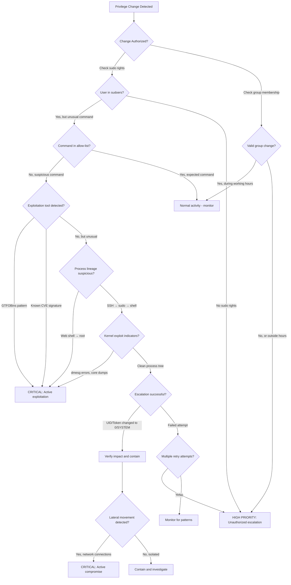

# Playbook: Privilege Escalation Response

## Document Control

| Field | Value |
|-------|-------|
| Playbook ID | PB-006 |
| Version | 2.0.0 |
| Classification | TLP:AMBER |
| Distribution | Internal SOC Use Only - Authorized Personnel |
| Last Updated | 2026-02-17 |
| Next Review | 2026-08-17 |
| Owner | Security Operations Center |
| Severity | Critical |
| Document Status | Production |

## Overview

This playbook provides comprehensive guidance for detecting, investigating, and responding to privilege escalation attempts across Linux, Unix, and Windows environments. Privilege escalation represents a critical phase in the attack lifecycle where adversaries attempt to gain elevated permissions to access restricted resources, install persistence mechanisms, or move laterally through the environment.

**Purpose**: Enable SOC analysts and autonomous agents to rapidly identify and contain privilege escalation attempts, minimize dwell time, and prevent further compromise.

**Scope**: Covers exploitation-based escalation, credential abuse, access token manipulation, and configuration weakness exploitation on all monitored endpoints.

## MITRE ATT&CK Mapping

### Primary Techniques

| Technique ID | Technique Name | Sub-Techniques | Description |
|--------------|----------------|----------------|-------------|
| T1068 | Exploitation for Privilege Escalation | N/A | Exploitation of software vulnerabilities to gain elevated privileges (kernel exploits, service vulnerabilities) |
| T1548 | Abuse Elevation Control Mechanism | .001 Setuid/Setgid<br>.002 Bypass UAC<br>.003 Sudo Caching<br>.004 Elevated Execution with Prompt | Circumventing mechanisms designed to control privilege elevation |
| T1134 | Access Token Manipulation | .001 Token Impersonation/Theft<br>.002 Create Process with Token<br>.003 Make and Impersonate Token<br>.004 Parent PID Spoofing<br>.005 SID-History Injection | Adversaries modify access tokens to operate under different security contexts |
| T1078 | Valid Accounts | .001 Default Accounts<br>.002 Domain Accounts<br>.003 Local Accounts<br>.004 Cloud Accounts | Abuse of legitimate credentials with elevated privileges |
| T1053 | Scheduled Task/Job | .002 At (Linux)<br>.003 Cron<br>.005 Scheduled Task (Windows) | Abuse of task scheduling for privilege escalation via misconfigurations |
| T1543 | Create or Modify System Process | .001 Launch Agent<br>.002 Systemd Service<br>.003 Windows Service<br>.004 Launch Daemon | Installation or modification of system services running with elevated privileges |
| T1055 | Process Injection | .001 DLL Injection<br>.002 Portable Executable Injection<br>.012 Process Hollowing | Code injection into privileged processes to escalate privileges |

### Detection Coverage

This playbook provides detection and response capabilities for:
- **Linux/Unix**: SUID/SGID exploitation, sudo abuse, kernel exploits, cron/systemd misconfigurations, capability abuse, polkit vulnerabilities
- **Windows**: UAC bypass, token theft/impersonation, service exploitation, scheduled task abuse, DLL hijacking, registry manipulation
- **Cross-Platform**: Credential theft, password hash cracking, privilege token reuse

## Wazuh Detection Rules

### Core Wazuh Rules

| Rule ID | Severity | Description | Platform | Detection Logic |
|---------|----------|-------------|----------|-----------------|
| 5401 | Medium | PAM: User login failed | Linux | Failed authentication attempts via PAM |
| 5402 | High | PAM: Possible break-in attempt | Linux | Multiple failed login attempts indicating brute force |
| 5501 | Low | PAM: Login session opened | Linux | Successful session establishment |
| 5502 | Low | Login session closed | Linux | Session termination event |
| 5503 | High | User privilege elevation | Linux | Successful privilege escalation via PAM |
| 5551 | Medium | su command executed | Linux | User switching via su |
| 80790 | Medium | Sudo command executed | Linux | Command execution via sudo |
| 80791 | Medium | Su command executed | Linux | Root shell acquisition via su |

### Extended Detection Rules

#### Linux Privilege Escalation Rules

| Rule ID | Description | Detection Pattern |
|---------|-------------|-------------------|
| 100610 | SUID binary execution with unusual arguments | Monitors SUID binaries for GTFOBins-style abuse |
| 100611 | Kernel exploit signature detected | Known CVE patterns in process execution |
| 100612 | Suspicious capability modification | Changes to file capabilities via setcap |
| 100613 | Polkit privilege escalation attempt | pkexec or polkit vulnerability exploitation |
| 100614 | Sudoers file modification | Changes to /etc/sudoers or /etc/sudoers.d/* |
| 100615 | Cron job created by non-root user | Potentially malicious cron job installation |
| 100616 | Systemd service created outside package manager | Service creation via systemctl outside normal deployment |
| 100617 | LD_PRELOAD or LD_LIBRARY_PATH manipulation | Dynamic linker hijacking attempts |
| 100618 | /etc/passwd or /etc/shadow access by web process | Web shell attempting credential access |

#### Windows Privilege Escalation Rules

| Event ID | Rule ID | Description | Detection Pattern |
|----------|---------|-------------|-------------------|
| 4672 | 60106 | Special privileges assigned to new logon | High-privilege token assignment (SeDebugPrivilege, SeTcbPrivilege) |
| 4673 | 60107 | Privileged service called | Use of sensitive privilege for security operations |
| 4674 | 60108 | Operation attempted on privileged object | Access to protected kernel or security objects |
| 4688 | 60109 | New process with elevated token | Process creation with token elevation type |
| 4697 | 60140 | Service installed in system | New service installation (potential persistence) |
| 1 (UAC) | 60200 | UAC consent prompt appeared | User Account Control elevation request |
| - | 100650 | UAC bypass technique detected | Known UAC bypass methods (fodhelper, eventvwr, sdclt) |
| - | 100651 | Token manipulation via Windows API | Suspicious API calls: OpenProcessToken, DuplicateTokenEx, ImpersonateLoggedOnUser |
| - | 100652 | SeDebugPrivilege enabled | Debug privilege grant to non-system process |
| - | 100653 | Scheduled task created with SYSTEM privileges | Task Scheduler abuse for escalation |

### Custom GTFOBins/LOLBAS Detection

```yaml
# Custom rule for GTFOBins exploitation
custom_rules:
  - id: 100620
    level: 12
    description: "GTFOBins exploitation attempt detected"
    match:
      any:
        - program_name: [vim, less, more, man, awk, find, wget, curl, tar, zip, python, perl, ruby, php, nc, nmap]
          command_pattern: ["sudo.*-c", "sudo.*!/bin/sh", "SHELL=", "!/bin/bash"]
    tags: [privilege_escalation, gtfobins, t1548.003]

  - id: 100621
    level: 12
    description: "LOLBAS privilege escalation detected"
    match:
      windows:
        program_name: [fodhelper.exe, eventvwr.exe, sdclt.exe, computerdefaults.exe, SilentCleanup]
        parent_not: explorer.exe
    tags: [privilege_escalation, lolbas, uac_bypass, t1548.002]
```

### File Integrity Monitoring Rules

```xml
<!-- Syscheck configuration for privilege escalation monitoring -->
<syscheck>
  <directories check_all="yes" realtime="yes" report_changes="yes">/etc/sudoers</directories>
  <directories check_all="yes" realtime="yes" report_changes="yes">/etc/sudoers.d</directories>
  <directories check_all="yes" realtime="yes" report_changes="yes">/etc/shadow</directories>
  <directories check_all="yes" realtime="yes" report_changes="yes">/etc/passwd</directories>
  <directories check_all="yes" realtime="yes" report_changes="yes">/etc/cron.d</directories>
  <directories check_all="yes" realtime="yes" report_changes="yes">/etc/systemd/system</directories>
  <directories check_all="yes" realtime="yes" report_changes="yes">/usr/bin</directories>
  <directories check_all="yes" realtime="yes" report_changes="yes">/usr/local/bin</directories>

  <!-- Windows registry monitoring -->
  <windows_registry>HKLM\Software\Microsoft\Windows\CurrentVersion\Run</windows_registry>
  <windows_registry>HKLM\Software\Microsoft\Windows\CurrentVersion\Policies\System</windows_registry>
  <windows_registry>HKLM\System\CurrentControlSet\Services</windows_registry>
</syscheck>
```

## Detection Decision Tree



## Forensic Artifacts

### Linux/Unix Artifacts

| Artifact Location | Purpose | Collection Method | Retention |
|-------------------|---------|-------------------|-----------|
| /var/log/auth.log | Authentication and authorization events | Wazuh logcollector | 90 days |
| /var/log/secure | Alternative auth log (RHEL/CentOS) | Wazuh logcollector | 90 days |
| /var/log/sudo.log | Detailed sudo command logging | Wazuh logcollector | 90 days |
| /var/log/audit/audit.log | Linux Audit daemon logs | Wazuh logcollector | 365 days |
| /etc/passwd | User account database | Syscheck MD5 monitoring | Changes tracked |
| /etc/shadow | Password hashes | Syscheck (no content collection) | Changes tracked |
| /etc/sudoers + /etc/sudoers.d/* | Sudo configuration | Syscheck with diff | Changes tracked |
| /etc/cron.d/, /var/spool/cron/ | Scheduled tasks | Syscheck | Changes tracked |
| /etc/systemd/system/ | Systemd service units | Syscheck | Changes tracked |
| /proc/[pid]/status | Process privilege state | On-demand via Wazuh command | Real-time |
| SUID binary inventory | find / -perm /4000 | Daily scheduled scan | 90 days |
| File capabilities audit | getcap -r / | Daily scheduled scan | 90 days |
| Kernel module list | lsmod output | Hourly snapshot | 30 days |
| ~/.bash_history | Command history | Wazuh logcollector | 90 days |

### Windows Artifacts

| Artifact Location | Purpose | Collection Method | Retention |
|-------------------|---------|-------------------|-----------|
| Security Event Log | Authentication and privilege events | Wazuh Windows agent | 90 days |
| Event ID 4672 | Special privileges assigned | Real-time forwarding | 365 days |
| Event ID 4673 | Privileged service called | Real-time forwarding | 365 days |
| Event ID 4674 | Operation on privileged object | Real-time forwarding | 365 days |
| Event ID 4688 | Process creation with token elevation | Real-time forwarding (with command line) | 90 days |
| Event ID 4697 | Service installed | Real-time forwarding | 365 days |
| UAC Event Log | Microsoft-Windows-UAC/Operational | Real-time forwarding | 90 days |
| Sysmon EID 1 | Process creation with integrity level | Real-time forwarding | 90 days |
| Sysmon EID 8 | CreateRemoteThread (injection) | Real-time forwarding | 90 days |
| Sysmon EID 10 | ProcessAccess (token theft) | Real-time forwarding | 90 days |
| Registry: SAM hive | Security Account Manager database | Syscheck monitoring | Changes tracked |
| Registry: SECURITY hive | LSA secrets and cached credentials | Syscheck monitoring | Changes tracked |
| Scheduled Tasks | C:\Windows\System32\Tasks\*.xml | Syscheck | Changes tracked |
| Services Registry | HKLM\System\CurrentControlSet\Services | Syscheck | Changes tracked |
| PowerShell Script Block Logs | Event ID 4104 | Real-time forwarding | 90 days |
| Windows Defender Logs | Detection events | Wazuh logcollector | 90 days |

### Memory Forensics (Advanced Investigation)

```yaml
memory_capture_triggers:
  automatic:
    - condition: "Active privilege escalation to SYSTEM/root"
    - condition: "Token manipulation API calls detected"
    - condition: "Kernel exploit signature matched"

  collection_tool: "WinPmem (Windows) / LiME (Linux)"

  analysis_targets:
    - Process token privileges
    - In-memory credential artifacts
    - Injected code segments
    - Kernel rootkit indicators
```

## Known Escalation Tools

### Linux/Unix Tools

| Tool Name | Category | Detection Signatures | Countermeasures |
|-----------|----------|---------------------|-----------------|
| LinPEAS | Enumeration | Script name, specific file access patterns | Block execution, monitor downloads |
| Linux Exploit Suggester | Enumeration | Kernel version enumeration, /proc reading | Monitor for rapid system queries |
| GTFOBins techniques | Exploitation | Unusual arguments to SUID binaries | Restrict SUID binaries, audit sudo |
| pwnkit (CVE-2021-4034) | Exploitation | pkexec execution with specific arguments | Patch polkit, monitor pkexec |
| DirtyPipe (CVE-2022-0847) | Exploitation | /proc/self/mem manipulation | Kernel patching, detect /proc writes |
| DirtyCow (CVE-2016-5195) | Exploitation | ptrace syscalls, memory writes | Kernel patching, auditd monitoring |
| BeRoot | Enumeration | Python script execution, config file reads | Application whitelisting |
| SUDO_INJECT | Exploitation | LD_PRELOAD with sudo | Disable LD_PRELOAD for sudo |
| Unix-privesc-check | Enumeration | Comprehensive file system scanning | Rate limiting, behavior analysis |

### Windows Tools

| Tool Name | Category | Detection Signatures | Countermeasures |
|-----------|----------|---------------------|-----------------|
| PowerUp | Enumeration | PowerShell module load, service enumeration | PowerShell logging, AMSI |
| SharpUp | Enumeration | .NET assembly load, WMI queries | EDR monitoring, code signing |
| WinPEAS | Enumeration | Executable name, registry enumeration | Application whitelisting |
| Mimikatz privilege::debug | Exploitation | SeDebugPrivilege request, LSASS access | Credential Guard, EDR blocking |
| PrintSpoofer | Exploitation | Print Spooler service interaction | Disable Print Spooler, patch |
| JuicyPotato / GodPotato | Exploitation | COM object manipulation, BITS abuse | DCOM hardening, service isolation |
| Rubeus | Kerberos abuse | .NET assembly, Kerberos ticket manipulation | EDR, Golden Ticket detection |
| Watson | Enumeration | Patch level enumeration, KB queries | Keep patched, monitor queries |
| Invoke-TokenManipulation | Exploitation | PowerShell token API calls | Constrained Language Mode, logging |
| UACME | UAC bypass | 60+ techniques, registry/file manipulation | Keep patched, UAC hardening |

### Detection Signatures

```yaml
yara_rules:
  - name: LinPEAS_script
    pattern: "linpeas.sh|PEASS-ng"

  - name: Mimikatz_memory
    pattern: "gentilkiwi|sekurlsa::logonpasswords|privilege::debug"

  - name: GodPotato_binary
    pattern: "GodPotato|JuicyPotato|SpoolSample"

behavioral_detections:
  - name: Rapid_System_Enumeration
    logic: "More than 50 file/registry accesses in under 30 seconds"

  - name: Privilege_Tool_Download
    logic: "curl/wget followed by chmod +x and execution within 2 minutes"

  - name: PowerShell_Obfuscation
    logic: "Base64 encoded PowerShell with token/privilege keywords"
```

## Automated Triage Steps

### 1. Entity Extraction

```yaml
entities:
  primary_actor:
    - type: user
      source: data.srcuser
      role: initiating_user
      enrichment:
        - user_risk_score
        - privileged_account_status
        - recent_activity_baseline

  target_context:
    - type: user
      source: data.dstuser
      role: target_privilege_context
      enrichment:
        - privilege_level (root/SYSTEM/admin)
        - legitimate_sudo_access

  host_context:
    - type: host
      source: agent.name
      enrichment:
        - asset_criticality
        - installed_security_tools
        - patch_level
        - normal_sudo_patterns

  process_context:
    - type: process
      source: data.command
      enrichment:
        - process_tree (parent chain)
        - command_line_arguments
        - binary_hash
        - digital_signature (Windows)
        - SUID_bit_status (Linux)

  network_context:
    - type: network
      source: data.src_ip
      enrichment:
        - connection_history
        - geolocation
        - threat_intelligence
```

### 2. Context Enrichment

#### Behavioral Baseline Analysis

```yaml
baseline_queries:
  user_sudo_history:
    query: "srcuser:${actor_user} AND rule.id:(80790 OR 5503)"
    timeframe: "last 30 days"
    metrics:
      - typical_commands
      - typical_time_of_day
      - frequency_distribution
      - success_rate

  host_privilege_patterns:
    query: "agent.id:${agent_id} AND rule.groups:privilege_escalation"
    timeframe: "last 7 days"
    metrics:
      - authorized_users
      - common_escalation_paths
      - baseline_frequency

  process_lineage_analysis:
    method: "Trace parent process chain back to initial access"
    indicators:
      - web_shell_ancestry: "httpd/nginx/apache → bash/sh"
      - ssh_session_ancestry: "sshd → bash → sudo"
      - scheduled_task_ancestry: "cron/Task Scheduler → script"
      - remote_execution: "winrm/psexec/ssh → command"
```

#### Threat Intelligence Enrichment

```yaml
threat_intel_checks:
  binary_reputation:
    - hash_lookup: VirusTotal, internal threat feed
    - signature_validation: Check code signing certificate
    - first_seen_analysis: New binary on host?

  known_exploits:
    - cve_matching: Map system version to known privilege escalation CVEs
    - exploit_db_correlation: Check for public exploit availability

  ioc_matching:
    - command_line_patterns: Match against known tool signatures
    - file_path_indicators: Typical tool installation paths
    - network_indicators: C2 callback patterns post-escalation
```

### 3. Severity Assessment Matrix

| Factor | Condition | Severity Modifier | Reasoning |
|--------|-----------|-------------------|-----------|
| Target Privilege | Escalation to root/SYSTEM | +3 | Highest privilege compromise |
| Target Privilege | Escalation to admin/wheel group | +2 | Administrative access achieved |
| Success Indicator | Privilege change confirmed (UID=0, token elevated) | +3 | Actual compromise vs attempt |
| Exploitation Tool | Known tool signature (Mimikatz, JuicyPotato) | +2 | Active attacker tooling |
| Exploitation Method | Zero-day or recent CVE (&lt;30 days) | +2 | Advanced threat capability |
| Asset Criticality | Production/Tier-1 system | +2 | High business impact |
| Asset Criticality | Domain Controller / IAM system | +3 | Critical infrastructure |
| Authorization Status | User has NO sudo rights | +2 | Unauthorized escalation |
| Authorization Status | User HAS sudo rights but unusual command | +1 | Policy violation |
| Temporal Context | Non-working hours (outside 9-5 local time) | +1 | Suspicious timing |
| Temporal Context | Weekend or holiday | +1 | Low legitimate activity period |
| Process Lineage | Web process ancestry (www-data → root) | +3 | Web shell compromise indicator |
| Process Lineage | Lateral movement origin (remote session → escalation) | +2 | Multi-stage attack |
| Lateral Indicators | Network connections immediately post-escalation | +2 | Active spread |
| Persistence Indicators | Scheduled task/cron job created | +2 | Maintaining access |
| Persistence Indicators | Service/systemd unit installed | +2 | Maintaining access |
| Data Access | Access to /etc/shadow, SAM hive, credential stores | +3 | Credential harvesting |

**Base Severity Calculation:**
- Base Score: Alert native severity (rule level)
- Final Score: Base + Sum(Modifiers)
- Thresholds:
  - 0-5: Low
  - 6-10: Medium
  - 11-15: High
  - 16+: Critical

**Example Calculation:**
```
Alert: Rule 80790 (sudo command) = Base 6 (Medium)
+ User has no sudo rights = +2
+ Target is root = +3
+ Process parent is web shell = +3
+ Outside working hours = +1
= Final Score: 15 (High, approaching Critical)
```

## Correlation Rules

### Alert Clustering Logic

```yaml
correlation_engine:
  cluster_window: 15_minutes

  cluster_rules:
    - name: "Privilege Escalation Campaign"
      description: "Multiple escalation techniques within timeframe"
      conditions:
        - min_alerts: 3
        - same_actor: true
        - same_agent: true
        - rule_groups: [privilege_escalation, authentication, exploitation]
      severity_boost: +2

    - name: "Post-Exploitation Activity"
      description: "Escalation followed by credential access or lateral movement"
      sequence:
        - step1: rule.groups:privilege_escalation
        - step2: rule.groups:(credential_access OR lateral_movement)
        - max_time_between: 30_minutes
      severity_boost: +3

    - name: "Reconnaissance to Escalation"
      description: "Enumeration followed by privilege escalation"
      sequence:
        - step1: rule.groups:(reconnaissance OR discovery)
        - step2: rule.groups:privilege_escalation
        - max_time_between: 60_minutes
      severity_boost: +1
```

### Timeline Construction

```yaml
timeline_builder:
  primary_event: ${privilege_escalation_alert}

  lookback_window: 6_hours
  lookahead_window: 2_hours

  event_sources:
    authentication:
      query: "srcuser:${actor_user} AND rule.groups:authentication"
      importance: high

    process_execution:
      query: "agent.id:${agent_id} AND rule.groups:(sysmon OR audit) AND data.type:process"
      importance: high

    file_activity:
      query: "agent.id:${agent_id} AND rule.groups:syscheck"
      importance: medium

    network_connections:
      query: "agent.id:${agent_id} AND rule.groups:firewall OR rule.groups:network"
      importance: high

    command_execution:
      query: "srcuser:${actor_user} AND data.command:*"
      importance: high

  visualization:
    format: chronological_with_annotations
    highlight:
      - initial_access_event
      - privilege_escalation_event
      - post_escalation_actions
```

### Blast Radius Assessment

```yaml
blast_radius_analysis:
  same_user_impact:
    query: "srcuser:${actor_user} AND timestamp:[${alert_time} TO now]"
    check_for:
      - additional_hosts_accessed
      - privileged_commands_executed
      - sensitive_data_accessed
      - credential_store_access

  compromised_host_impact:
    query: "agent.id:${agent_id}"
    check_for:
      - other_users_on_host
      - network_shares_accessible
      - database_connections
      - cloud_api_access (AWS CLI, Azure CLI)

  lateral_movement_scope:
    network_analysis:
      - outbound_connections_post_escalation
      - smb_rdp_ssh_sessions_initiated
      - remote_execution_attempts (psexec, wmi, ssh)

  credential_exposure:
    check_accessed_secrets:
      - password_managers
      - ssh_keys (~/.ssh/, C:\Users\*\.ssh\)
      - cloud_credentials (~/.aws/, environment variables)
      - application_secrets (/etc/app/secrets, web.config)

  downstream_systems:
    trust_relationships:
      - systems_this_host_can_access (jump boxes, admin consoles)
      - service_accounts_on_this_host
      - federated_identity_links
```

## Response Plan

### Classification and Routing

```yaml
triage_classification:
  true_positive_confirmed:
    criteria:
      - Unauthorized user gained elevated privileges
      - Known exploitation tool/technique confirmed
      - Post-escalation malicious activity observed
    routing: Immediate containment workflow

  true_positive_authorized:
    criteria:
      - User has legitimate sudo access
      - Command within approved scope
      - Normal business hours and pattern
    routing: Log and close, update baseline

  suspicious_requires_investigation:
    criteria:
      - Edge case (authorized user, unusual command)
      - Partial indicators (tool detected but no privilege change)
      - First-time behavior deviation
    routing: Investigation agent workflow

  false_positive:
    criteria:
      - Known admin performing approved maintenance
      - Automated system process (apt upgrade, Windows Update)
      - Alert misconfiguration
    routing: Tune rule, document exception
```

### Immediate Containment Actions

**CRITICAL**: All containment actions require approval unless pre-authorized for specific scenarios (e.g., active ransomware, domain controller compromise).

#### Option 1: Disable Compromised Account

```yaml
action: disable_user_account
priority: 1
risk_level: high
business_impact: moderate

target:
  user: ${actor_user}
  scope: all_systems  # or specific_host

execution:
  linux:
    command: "usermod -L ${actor_user} && passwd -l ${actor_user}"
    verification: "passwd -S ${actor_user} | grep -q 'L'"

  windows:
    command: "net user ${actor_user} /active:no"
    verification: "net user ${actor_user} | findstr 'Account active'"

  active_directory:
    command: "Disable-ADAccount -Identity ${actor_user}"
    verification: "Get-ADUser ${actor_user} | Select Enabled"

justification: "Prevent further abuse of compromised account"

rollback_plan:
  condition: "False positive confirmed within 4 hours"
  action: "Re-enable account and notify user"

approval_required: true
timeout: 60_seconds
```

#### Option 2: Isolate Affected Host

```yaml
action: network_isolation
priority: 1
risk_level: critical
business_impact: high

target:
  agent_id: ${agent_id}
  hostname: ${agent_name}

isolation_methods:
  firewall_block_all:
    method: "Wazuh active-response firewall-drop"
    scope: "All inbound and outbound except management"
    command: "firewall-drop.sh"

  network_quarantine_vlan:
    method: "Switch port VLAN reassignment"
    vlan_id: 999  # Quarantine VLAN
    requires: "Network automation integration"

  edr_isolation:
    method: "CrowdStrike/SentinelOne network containment"
    api_call: "POST /devices/${device_id}/contain"

exceptions:
  - allow_management_traffic: true
  - allow_wazuh_agent_traffic: true
  - allow_logging_traffic: true

justification: "Prevent lateral movement and data exfiltration"

verification:
  check: "Test outbound connectivity blocked"
  test_command: "curl -m 5 https://google.com || echo 'Isolated'"

approval_required: true
timeout: 120_seconds

notification:
  - stakeholder: IT Operations
    message: "Host ${hostname} isolated due to privilege escalation incident ${incident_id}"
  - stakeholder: Asset Owner
    template: "containment_notification"
```

#### Option 3: Terminate Malicious Process

```yaml
action: kill_process
priority: 2
risk_level: medium
business_impact: low

target:
  process_id: ${process_id}
  process_name: ${process_name}
  agent_id: ${agent_id}

execution:
  linux:
    command: "kill -9 ${process_id}"
    verification: "! ps -p ${process_id}"

  windows:
    command: "taskkill /F /PID ${process_id}"
    verification: "! tasklist | findstr ${process_id}"

pre_checks:
  - verify_process_still_running
  - confirm_not_critical_system_process
  - check_process_tree_for_children

post_execution:
  - collect_process_memory_dump (if possible)
  - log_process_termination_event
  - scan_for_process_restart_attempts

justification: "Stop active privilege escalation tool"

approval_required: false  # Auto-approved for known malicious tools
timeout: 30_seconds
```

#### Option 4: Revoke Elevated Session

```yaml
action: revoke_privileged_session
priority: 2
risk_level: medium
business_impact: low

target:
  session_id: ${session_id}
  user: ${actor_user}
  agent_id: ${agent_id}

execution:
  linux:
    method: "Kill all sudo sessions"
    command: "pkill -u ${actor_user} -TERM"
    alternative: "sudo -k -u ${actor_user}"

  windows:
    method: "Terminate elevated processes"
    command: "Get-Process -IncludeUserName | Where {$_.UserName -eq '${domain}\${user}' -and $_.SI -eq 0} | Stop-Process -Force"

justification: "Revoke active elevated privilege session"

approval_required: false  # Auto-approved if part of unauthorized escalation
timeout: 45_seconds
```

#### Option 5: Reset User Credentials (Emergency)

```yaml
action: emergency_credential_reset
priority: 1
risk_level: high
business_impact: high

trigger_conditions:
  - credential_dumping_detected: true
  - lateral_movement_with_stolen_creds: true
  - domain_admin_compromise: true

target:
  user: ${actor_user}
  scope: enterprise_wide

execution:
  force_password_change:
    - invalidate_all_sessions
    - require_mfa_re_enrollment
    - reset_password_to_random
    - notify_user_via_alternate_channel

  kerberos_ticket_invalidation:
    method: "Revoke all Kerberos tickets"
    command: "klist purge"

  api_token_revocation:
    - cloud_access_tokens
    - ssh_keys
    - application_api_keys

justification: "Prevent credential reuse across environment"

approval_required: true  # CISO approval for domain admin reset
timeout: 300_seconds
```

### Investigation Workflow

#### Phase 1: Initial Triage (Target: &lt;5 minutes)

```yaml
triage_agent_tasks:
  1_alert_validation:
    - verify_alert_accuracy
    - check_for_known_false_positive_pattern
    - classify_alert_type

  2_context_gathering:
    - extract_entities (user, host, process, command)
    - enrich_with_threat_intel
    - query_user_baseline
    - query_host_baseline

  3_severity_calculation:
    - apply_severity_matrix
    - calculate_blast_radius_estimate
    - determine_asset_criticality

  4_initial_classification:
    outputs:
      - classification: [true_positive | false_positive | needs_investigation]
      - confidence_score: 0-100
      - recommended_action: [contain | investigate | close]
      - escalation_required: boolean

  5_stakeholder_notification:
    - post_to_slack: "#{soc_alerts}"
    - create_incident_ticket
    - assign_to_on_call_analyst (if critical)
```

#### Phase 2: Deep Investigation (Target: &lt;2 hours)

```yaml
investigation_agent_tasks:
  1_timeline_reconstruction:
    goal: "Map complete attack chain"
    steps:
      - identify_initial_access_vector
      - trace_reconnaissance_activities
      - map_privilege_escalation_attempt
      - identify_post_exploitation_actions
    outputs:
      - visual_timeline
      - annotated_event_sequence

  2_technical_analysis:
    process_forensics:
      - full_process_tree_analysis
      - parent_child_relationships
      - unusual_process_privileges
      - memory_analysis (if captured)

    file_forensics:
      - dropped_files_identification
      - modified_system_files
      - persistence_mechanism_detection
      - hash_analysis_and_reputation

    credential_analysis:
      - accessed_credential_stores
      - password_spray_indicators
      - hash_cracking_attempts
      - kerberos_ticket_anomalies

    network_forensics:
      - c2_communication_indicators
      - lateral_movement_connections
      - data_exfiltration_attempts
      - dns_tunneling_analysis

  3_root_cause_analysis:
    determine:
      - how_did_attacker_gain_initial_access
      - what_vulnerability_was_exploited
      - why_did_escalation_succeed
      - what_security_controls_failed

  4_scope_determination:
    assess:
      - other_compromised_accounts
      - other_compromised_hosts
      - accessed_sensitive_data
      - installed_persistence_mechanisms

  5_evidence_collection:
    collect:
      - relevant_log_excerpts
      - forensic_artifacts
      - screenshots_of_key_findings
      - iocs_for_threat_hunting
```

#### Phase 3: Threat Hunting (Proactive)

```yaml
threat_hunting_queries:
  hunt_for_similar_activity:
    - name: "Same user on other hosts"
      query: "srcuser:${actor_user} AND rule.groups:privilege_escalation"
      timeframe: "last 30 days"

    - name: "Same exploit tool on other hosts"
      query: "data.command:*${tool_signature}*"
      timeframe: "last 7 days"

    - name: "Same source IP attempting escalation"
      query: "data.src_ip:${source_ip} AND rule.groups:privilege_escalation"
      timeframe: "last 14 days"

  hunt_for_persistence:
    - cron_jobs_created: "rule.id:100615"
    - services_installed: "rule.id:(60140 OR 100616)"
    - scheduled_tasks: "rule.id:100653"
    - suid_modifications: "rule.id:100612"

  hunt_for_lateral_movement:
    - rdp_sessions: "rule.groups:windows AND event.id:4624 AND data.logon_type:10"
    - smb_shares_accessed: "rule.groups:windows AND event.id:5140"
    - ssh_sessions: "rule.groups:sshd AND rule.id:5501"
    - psexec_execution: "rule.groups:sysmon AND event.id:1 AND data.image:*psexec*"
```

### Recovery and Remediation

#### Immediate Recovery Actions

```yaml
recovery_plan:
  1_credential_rotation:
    priority: critical
    actions:
      - reset_compromised_account_password
      - revoke_all_active_sessions
      - invalidate_kerberos_tickets
      - rotate_ssh_keys
      - rotate_api_tokens
      - force_mfa_re_enrollment
    validation:
      - verify_old_credentials_invalid
      - test_new_credentials_working

  2_privilege_audit:
    priority: high
    actions:
      - review_sudo_sudoers_file
      - audit_group_memberships
      - review_scheduled_tasks_cron_jobs
      - audit_service_account_permissions
      - check_delegated_permissions (AD)
    outputs:
      - list_of_excessive_privileges_to_remove
      - recommended_privilege_reductions

  3_process_cleanup:
    priority: critical
    actions:
      - kill_all_user_processes
      - terminate_suspicious_services
      - remove_malicious_scheduled_tasks
      - unload_suspicious_kernel_modules (Linux)
      - remove_unauthorized_services
    verification:
      - scan_for_persistence_mechanisms
      - verify_clean_process_list

  4_persistence_removal:
    priority: critical
    locations_to_check:
      linux:
        - /etc/cron.d/*, /var/spool/cron/*
        - /etc/systemd/system/*
        - ~/.bashrc, ~/.bash_profile
        - /etc/ld.so.preload
        - kernel modules (lsmod)
        - SUID binaries (find / -perm /4000)
      windows:
        - C:\Windows\System32\Tasks\*
        - HKLM\Software\Microsoft\Windows\CurrentVersion\Run*
        - Services registry
        - Startup folders
        - WMI event subscriptions
    actions:
      - remove_malicious_entries
      - restore_from_known_good_backup
      - re_baseline_system_state

  5_vulnerability_remediation:
    priority: high
    actions:
      - identify_exploited_vulnerability
      - apply_security_patches
      - harden_configuration (disable unnecessary services)
      - update_security_policies
      - implement_compensating_controls
    validation:
      - verify_patch_applied
      - run_vulnerability_scan
      - attempt_exploit_reproduction (in test environment)
```

#### Long-Term Remediation

```yaml
post_incident_improvements:
  1_detection_tuning:
    - update_wazuh_rules_for_missed_indicators
    - add_custom_detection_for_specific_exploit
    - tune_false_positive_prone_rules
    - implement_new_correlation_rules

  2_preventive_controls:
    - apply_principle_of_least_privilege
    - implement_just_in_time_access (JIT)
    - deploy_application_whitelisting
    - enable_credential_guard (Windows)
    - configure_sudo_with_minimal_privileges
    - disable_unnecessary_suid_binaries
    - implement_file_integrity_monitoring_expansion

  3_monitoring_expansion:
    - deploy_edr_if_not_present
    - enable_powershell_script_block_logging
    - enable_audit_daemon_on_linux
    - implement_sysmon_on_windows
    - increase_log_retention_for_critical_systems

  4_training_and_awareness:
    - security_awareness_for_affected_users
    - incident_response_lessons_learned_session
    - update_playbooks_with_new_techniques
```

## Communication Templates

### SOC Internal Escalation

**Template: Critical Privilege Escalation Detected**

```
SUBJECT: [CRITICAL] Privilege Escalation - ${hostname} - Incident #${incident_id}

PRIORITY: URGENT

SUMMARY:
Privilege escalation detected on ${hostname} at ${timestamp}.
User: ${actor_user}
Target Privilege: ${target_privilege}
Method: ${escalation_method}
Status: ${containment_status}

SEVERITY ASSESSMENT:
- Asset Criticality: ${asset_tier}
- Escalation Success: ${success_status}
- Blast Radius: ${affected_systems_count} systems potentially impacted
- Threat Actor TTP: ${mitre_attack_techniques}

IMMEDIATE ACTIONS TAKEN:
${containment_actions_list}

INVESTIGATION STATUS:
- Initial Triage: ${triage_completion}%
- Root Cause Identified: ${root_cause_status}
- Persistence Mechanisms Found: ${persistence_count}
- Lateral Movement Detected: ${lateral_movement_status}

REQUIRED APPROVALS:
${pending_approval_actions}

ASSIGNED TO:
- Lead Analyst: ${analyst_name}
- Investigation Agent: ${agent_id}
- On-Call Engineer: ${oncall_name}

NEXT STEPS:
1. ${next_action_1}
2. ${next_action_2}
3. ${next_action_3}

INCIDENT CHANNEL: #incident-${incident_id}
WAR ROOM: ${meeting_link}

-- Automated SOC Alert System --
```

### System Owner Notification

**Template: Security Incident Affecting Your System**

```
SUBJECT: Security Incident Notification - ${hostname}

CLASSIFICATION: TLP:AMBER - Internal Distribution Only

Dear ${asset_owner_name},

This message is to inform you of a security incident affecting system(s) under your responsibility.

INCIDENT SUMMARY:
- Incident ID: ${incident_id}
- Affected System: ${hostname} (${ip_address})
- Incident Type: Privilege Escalation
- Detection Time: ${detection_timestamp}
- Severity: ${severity_level}

WHAT HAPPENED:
${incident_description_non_technical}

Example: "An unauthorized user attempted to gain administrative privileges on your system. Our security monitoring detected this activity and automatically contained the threat."

IMPACT TO YOUR OPERATIONS:
${business_impact_description}

Potential Impacts:
- System Availability: ${availability_impact}
- Data Confidentiality: ${confidentiality_impact}
- User Access: ${access_impact}

ACTIONS TAKEN:
${containment_actions_non_technical}

Example: "We have temporarily isolated the affected system from the network and disabled the compromised user account to prevent further damage."

REQUIRED ACTIONS FROM YOU:
1. ${owner_action_1}
2. ${owner_action_2}
3. ${owner_action_3}

EXPECTED TIMELINE:
- Investigation Completion: ${eta_investigation}
- System Restoration: ${eta_restoration}
- Full Remediation: ${eta_remediation}

CONTACT INFORMATION:
- Incident Lead: ${analyst_name} - ${analyst_email}
- SOC Hotline: ${soc_phone}
- Incident Channel: #incident-${incident_id}

We will provide updates every ${update_frequency} hours until resolution.

Thank you for your cooperation.

Security Operations Center
```

### Executive Briefing

**Template: Executive Summary - Critical Incident**

```
EXECUTIVE INCIDENT BRIEFING
Incident #${incident_id} - Privilege Escalation

CLASSIFICATION: TLP:AMBER

BOTTOM LINE UP FRONT (BLUF):
${executive_summary_one_sentence}

INCIDENT OVERVIEW:
- What: ${what_happened}
- When: ${when_detected}
- Where: ${affected_systems_business_context}
- Impact: ${business_impact_high_level}

CURRENT STATUS: ${status_color}
🔴 Active / Critical
🟡 Contained / Investigating
🟢 Resolved / Monitoring

BUSINESS RISK:
- Data Compromise: ${data_risk_level}
- Operational Impact: ${operational_impact}
- Regulatory Exposure: ${compliance_risk}
- Reputational Risk: ${reputation_risk}

RESPONSE ACTIONS:
✓ ${completed_action_1}
✓ ${completed_action_2}
⏳ ${in_progress_action_1}
⏳ ${in_progress_action_2}

NEXT STEPS:
- Immediate: ${next_24h}
- Short Term: ${next_week}
- Long Term: ${improvements}

EXECUTIVE DECISION REQUIRED:
${decision_needed_if_any}

FINANCIAL IMPACT ESTIMATE:
- Incident Response Cost: ${cost_estimate}
- Business Disruption: ${disruption_cost}
- Remediation Investment: ${remediation_cost}

CONTACT: ${ciso_name} - ${ciso_contact}

Last Updated: ${timestamp}
Next Update: ${next_update_time}
```

## Regulatory Compliance Mapping

### NIST 800-53 Controls

| Control | Control Name | Playbook Implementation | Evidence Collection |
|---------|--------------|-------------------------|---------------------|
| AC-2 | Account Management | User account monitoring, sudo access review | Wazuh auth logs, sudoers file changes |
| AC-6 | Least Privilege | Privilege escalation detection, unauthorized elevation alerting | Rule 5503, 80790, privilege audit logs |
| AC-6(1) | Least Privilege - Authorize Access to Security Functions | Monitoring of security-sensitive commands | Custom rules for security tool execution |
| AC-6(2) | Least Privilege - Non-privileged Access for Nonsecurity Functions | Detection of unnecessary privilege use | Baseline deviation alerts |
| AC-6(9) | Least Privilege - Auditing Use of Privileged Functions | Comprehensive logging of sudo/su/UAC | All privilege escalation Wazuh rules |
| AU-2 | Audit Events | Logging all privilege-related events | Wazuh archives, audit.log, Event ID 4672 |
| AU-6 | Audit Review, Analysis, and Reporting | Automated triage, correlation, alerting | Incident reports, alert dashboards |
| AU-12 | Audit Generation | Wazuh agent configuration for privilege monitoring | Agent configuration files, syscheck setup |
| IR-4 | Incident Handling | Complete incident response workflow | Incident tickets, timeline documentation |
| IR-5 | Incident Monitoring | Real-time detection and alerting | Wazuh alerts, Slack notifications |
| IR-6 | Incident Reporting | Internal escalation and executive briefings | Communication templates, incident reports |
| SI-4 | System Monitoring | Continuous monitoring via Wazuh agents | Agent status, rule execution logs |

### CIS Benchmarks

| Benchmark | Recommendation | Detection Coverage | Remediation Guidance |
|-----------|----------------|-------------------|----------------------|
| CIS Linux 5.3.3 | Configure sudo to use pty | Detects sudo without pty (potential log evasion) | Configure `Defaults use_pty` in sudoers |
| CIS Linux 5.3.4 | Ensure sudo log file exists | Validates sudo logging configuration | Configure `Defaults logfile="/var/log/sudo.log"` |
| CIS Linux 4.1.3 | Ensure authentication is required for single user mode | Detects unauthorized single-user access | Configure SINGLE directive in /etc/sysconfig/init |
| CIS Windows 2.3.1.1 | Ensure 'Accounts: Administrator account status' is set to 'Disabled' | Monitors built-in admin account usage | Disable built-in Administrator account |
| CIS Windows 2.3.11.6 | Ensure 'Network access: Do not allow anonymous enumeration of SAM accounts' is set to 'Enabled' | Detects SAM enumeration attempts | Configure RestrictAnonymousSAM registry key |
| CIS Windows 5.1 | Ensure 'User Account Control: Admin Approval Mode for the Built-in Administrator account' is set to 'Enabled' | Detects UAC bypass attempts | Enable UAC for administrator |

### ISO 27001 Controls

| Control | Control Description | Playbook Alignment | Audit Evidence |
|---------|---------------------|-------------------|----------------|
| A.9.2.2 | User access provisioning | Monitors unauthorized privilege acquisition | Privilege audit reports, access reviews |
| A.9.2.3 | Management of privileged access rights | Tracks use of sudo, administrator accounts | Sudo logs, admin activity logs |
| A.9.2.5 | Review of user access rights | Periodic privilege audit procedures | Privilege review documentation |
| A.9.4.2 | Secure log-on procedures | Monitors authentication bypass techniques | Auth logs, PAM events |
| A.12.4.1 | Event logging | Comprehensive privilege event logging | Wazuh log archives, syslog |
| A.12.4.3 | Administrator and operator logs | Dedicated tracking of privileged actions | Sudo logs, Windows Security logs |
| A.16.1.4 | Assessment of information security events | Severity assessment and triage | Incident classification records |
| A.16.1.5 | Response to information security incidents | Complete response workflow | Incident response documentation |

### PCI DSS Requirements

| Requirement | Description | Implementation | Evidence |
|-------------|-------------|----------------|----------|
| 10.2.2 | Log all actions taken by any individual with root or administrative privileges | All sudo/su/admin actions logged | Wazuh rules 80790, 80791, Event 4672 |
| 10.2.5 | Log unauthorized access attempts to data | Detects unauthorized privilege escalation | Rule 5402, 5503, failed elevation attempts |
| 10.3 | Record audit trail entries with relevant details | Enriched alert context (user, time, host, command) | Wazuh alert JSON with full context |
| 10.6 | Review logs and security events for all system components | Automated log analysis and correlation | Correlation engine, investigation agent |
| 10.7 | Retain audit trail history for at least one year | Log retention configuration | 90-365 day retention per artifact type |
| 8.7 | All access to databases containing cardholder data must be through programmatic methods | Detects direct database file access | File integrity monitoring on DB files |

### GDPR Article 32 - Security of Processing

| Requirement | Implementation | Detection Capability | Documentation |
|-------------|----------------|---------------------|---------------|
| Ability to ensure confidentiality | Prevents unauthorized privilege escalation to access personal data | Detects and contains credential theft, privilege abuse | Incident reports showing containment |
| Ability to ensure integrity | Monitors unauthorized system modifications | File integrity monitoring, process monitoring | Syscheck alerts, modification logs |
| Ability to ensure availability | Rapid containment to prevent system compromise | Automated response, network isolation | SLA compliance reports |
| Ability to restore availability | Recovery procedures and system restoration | Recovery plan execution | Recovery documentation |
| Process for testing effectiveness | Regular playbook testing and tuning | False positive rate, detection coverage metrics | Testing reports, metrics dashboards |

## Agent Pipeline Integration

### Autonomous Agent Workflow

```yaml
agent_pipeline:
  stage_1_detection:
    agent: wazuh_manager
    responsibilities:
      - ingest_logs_from_agents
      - apply_detection_rules
      - generate_alerts
    output: raw_alert_json

  stage_2_triage:
    agent: triage_agent
    trigger: alert_severity >= medium
    responsibilities:
      - entity_extraction
      - context_enrichment
      - baseline_comparison
      - severity_calculation
      - initial_classification
    output:
      - classification: [true_positive | false_positive | suspicious]
      - confidence: 0-100
      - recommended_action: [contain | investigate | close]
    sla: complete_within_5_minutes

  stage_3_investigation:
    agent: investigation_agent
    trigger: classification == "true_positive" OR classification == "suspicious"
    responsibilities:
      - timeline_reconstruction
      - process_ancestry_analysis
      - forensic_artifact_collection
      - blast_radius_assessment
      - root_cause_analysis
      - ioc_extraction
    output:
      - detailed_investigation_report
      - attack_chain_diagram
      - scope_assessment
      - remediation_recommendations
    sla: complete_within_2_hours

  stage_4_policy_validation:
    agent: policy_guard
    trigger: containment_action_recommended
    responsibilities:
      - check_asset_criticality
      - validate_business_hours
      - check_maintenance_windows
      - verify_approval_requirements
      - assess_business_impact
    output:
      - action_approved: boolean
      - requires_human_approval: boolean
      - approval_justification: string
    sla: complete_within_30_seconds

  stage_5_response_execution:
    agent: response_orchestrator
    trigger: action_approved == true
    responsibilities:
      - execute_containment_actions
      - verify_action_success
      - rollback_on_failure
      - notify_stakeholders
      - create_incident_ticket
      - update_threat_intel
    output:
      - actions_executed: list
      - success_status: boolean
      - incident_ticket_id: string
    sla: execute_within_10_minutes

  stage_6_threat_hunting:
    agent: threat_hunter_agent
    trigger: incident_severity == critical
    responsibilities:
      - hunt_for_similar_iocs_across_fleet
      - identify_affected_systems
      - proactive_containment_recommendations
    output:
      - additional_compromised_systems: list
      - hunting_report: document
    sla: complete_within_4_hours
```

### Human-in-the-Loop Decision Points

```yaml
human_approval_required:
  scenario_1:
    condition: "Asset criticality == tier1 AND containment_action == isolate_host"
    approver: SOC Lead or Security Manager
    timeout: 15_minutes
    fallback: Escalate to CISO

  scenario_2:
    condition: "Business hours AND production_system AND user_count > 100"
    approver: Asset Owner + SOC Lead
    timeout: 30_minutes
    fallback: Proceed with read-only investigation

  scenario_3:
    condition: "Domain admin compromise OR domain controller affected"
    approver: CISO + IT Director
    timeout: 10_minutes
    fallback: Auto-execute if active lateral movement detected

  scenario_4:
    condition: "False positive likelihood > 30%"
    approver: Senior SOC Analyst
    timeout: 5_minutes
    fallback: Escalate to investigation instead of containment
```

### Agent Communication Protocol

```yaml
inter_agent_messaging:
  message_format: json

  example_triage_to_investigation:
    from: triage_agent
    to: investigation_agent
    message:
      alert_id: "8f3a2b1c-4d5e-6f7a-8b9c-0d1e2f3a4b5c"
      classification: "true_positive"
      confidence: 85
      priority: "high"
      context:
        actor_user: "webadmin"
        compromised_host: "web-prod-03"
        escalation_method: "sudo_exploit"
        indicators:
          - "gtfobins_pattern_detected"
          - "web_shell_parent_process"
          - "production_asset"
      recommended_focus:
        - "trace_initial_web_compromise"
        - "identify_persistence_mechanisms"
        - "check_for_lateral_movement"

  example_policy_guard_response:
    from: policy_guard
    to: response_orchestrator
    message:
      action_request_id: "req-12345"
      approval_status: "approved_with_conditions"
      conditions:
        - "notify_asset_owner_before_execution"
        - "maintain_read_only_network_access_for_logging"
        - "schedule_rollback_after_4_hours_if_not_extended"
      risk_assessment:
        business_impact: "moderate"
        technical_risk: "low"
        compliance_risk: "low"
      approver: "auto_approved_per_policy_PB006_section_5"
```

## SLA and KPI Targets

### Service Level Agreements

| Metric | Target | Critical Systems | Non-Critical Systems | Measurement Method |
|--------|--------|------------------|---------------------|-------------------|
| **Detection Time** | &lt;2 minutes | &lt;1 minute | &lt;5 minutes | Time from log ingestion to alert generation |
| **Triage Completion** | &lt;5 minutes | &lt;3 minutes | &lt;10 minutes | Time from alert to classification complete |
| **Containment Execution** | &lt;10 minutes | &lt;5 minutes | &lt;20 minutes | Time from approval to containment verified |
| **Investigation Completion** | &lt;2 hours | &lt;1 hour | &lt;4 hours | Time from triage to full investigation report |
| **Stakeholder Notification** | &lt;15 minutes | &lt;5 minutes | &lt;30 minutes | Time from detection to first notification |
| **Incident Resolution** | &lt;24 hours | &lt;8 hours | &lt;48 hours | Time from detection to full remediation |
| **Post-Incident Report** | &lt;72 hours | &lt;48 hours | &lt;5 days | Time from resolution to final report |

### Key Performance Indicators

| KPI | Target | Measurement | Review Frequency |
|-----|--------|-------------|------------------|
| **False Positive Rate** | &lt;5% | (False Positives / Total Alerts) × 100 | Weekly |
| **True Positive Identification Rate** | &gt;95% | (Correctly Classified TP / Total TP) × 100 | Weekly |
| **Mean Time to Detect (MTTD)** | &lt;2 minutes | Average time from event to alert | Daily |
| **Mean Time to Respond (MTTR)** | &lt;10 minutes | Average time from alert to containment | Daily |
| **Mean Time to Investigate (MTTI)** | &lt;2 hours | Average time to complete investigation | Weekly |
| **Mean Time to Remediate (MTTRem)** | &lt;24 hours | Average time to full remediation | Weekly |
| **Agent Pipeline Success Rate** | &gt;99% | Successful agent workflow executions | Daily |
| **Containment Success Rate** | &gt;98% | Successful containment action executions | Weekly |
| **Detection Coverage** | &gt;90% | Percentage of MITRE ATT&CK sub-techniques covered | Monthly |
| **Playbook Adherence** | 100% | Percentage of incidents following playbook | Monthly |
| **Escalation Accuracy** | &gt;95% | Appropriate escalations to human analysts | Weekly |
| **Customer Satisfaction** | &gt;4.5/5 | Asset owner/stakeholder satisfaction survey | Quarterly |

### Automation Metrics

| Metric | Target | Definition | Business Value |
|--------|--------|------------|----------------|
| **Autonomous Triage Rate** | &gt;80% | Percentage of alerts fully triaged by agents | Reduce analyst workload |
| **Auto-Containment Rate** | &gt;60% | Percentage of incidents contained without human intervention | Faster response |
| **Human-in-the-Loop Time** | &lt;5 minutes | Average time for human approval when required | Minimize delay |
| **Playbook Automation Coverage** | &gt;75% | Percentage of response actions automated | Improve consistency |
| **Agent-Driven Investigation Rate** | &gt;70% | Percentage of investigations completed autonomously | Scale SOC capacity |

### Reporting and Dashboard

```yaml
soc_dashboard:
  real_time_metrics:
    - active_incidents_count
    - alerts_last_hour
    - false_positive_rate_today
    - average_triage_time_today
    - containment_actions_pending_approval

  trending_metrics:
    - privilege_escalation_attempts_trend (7 days)
    - top_targeted_hosts (30 days)
    - top_actor_users (30 days)
    - most_common_escalation_methods (30 days)
    - sla_compliance_trend (90 days)

  agent_performance:
    - triage_agent_accuracy
    - investigation_agent_completion_rate
    - policy_guard_approval_rate
    - response_orchestrator_success_rate

  compliance_view:
    - nist_control_coverage
    - cis_benchmark_compliance
    - audit_log_completeness
    - incident_documentation_rate
```

## Playbook Maintenance

### Version Control

```yaml
versioning:
  current_version: 2.0.0
  version_history:
    - version: 2.0.0
      date: 2026-02-17
      changes:
        - Expanded MITRE ATT&CK coverage to 7 primary techniques
        - Added comprehensive Windows Event ID detection
        - Integrated autonomous agent pipeline
        - Added regulatory compliance mapping (NIST, CIS, ISO, PCI, GDPR)
        - Enhanced SLA/KPI metrics
        - Added communication templates
        - Expanded forensic artifacts section
    - version: 1.0.0
      date: 2024-11-15
      changes:
        - Initial playbook release
        - Basic detection and response workflow

  next_review_date: 2026-08-17
  review_frequency: every_6_months
```

### Continuous Improvement

```yaml
improvement_process:
  post_incident_review:
    - conduct_lessons_learned_session
    - identify_detection_gaps
    - identify_response_gaps
    - update_playbook_with_new_techniques
    - retrain_agents_with_new_patterns

  threat_intelligence_integration:
    - subscribe_to_threat_intel_feeds
    - monitor_new_cves_for_privilege_escalation
    - update_detection_rules_for_new_ttp
    - add_new_tools_to_known_tools_list

  agent_model_retraining:
    - collect_feedback_on_false_positives
    - collect_feedback_on_missed_detections
    - retrain_classification_models_quarterly
    - validate_model_performance_before_deployment

  metrics_driven_optimization:
    - analyze_sla_misses
    - identify_bottlenecks_in_pipeline
    - optimize_slow_correlation_rules
    - tune_alert_thresholds_based_on_false_positive_rate
```

## Appendix

### Quick Reference Commands

#### Linux Investigation Commands

```bash
# Check current sudo sessions
who -u

# View recent sudo commands
tail -100 /var/log/sudo.log

# List SUID binaries
find / -perm /4000 -type f 2>/dev/null

# Check file capabilities
getcap -r / 2>/dev/null

# View recent authentication events
grep -i "sudo\|su\|elevated" /var/log/auth.log | tail -50

# Check for unusual cron jobs
find /etc/cron* /var/spool/cron -type f -exec ls -la {} \;

# List systemd services created recently
find /etc/systemd/system -type f -mtime -7 -ls

# Check process tree with privileges
ps auxf | grep -E "UID|PID|COMMAND"

# Audit current user privileges
id; groups; sudo -l

# Check for LD_PRELOAD hijacking
env | grep LD_
```

#### Windows Investigation Commands

```powershell
# Check special privileges assigned recently
Get-WinEvent -FilterHashtable @{LogName='Security';ID=4672} -MaxEvents 50 | Format-List

# View recent service installations
Get-WinEvent -FilterHashtable @{LogName='System';ID=7045} -MaxEvents 20 | Format-List

# List scheduled tasks created recently
Get-ScheduledTask | Where {$_.Date -gt (Get-Date).AddDays(-7)} | Format-Table

# Check for UAC bypass indicators
Get-WinEvent -FilterHashtable @{LogName='Microsoft-Windows-UAC/Operational';ID=1} -MaxEvents 50

# View recent process creation with elevation
Get-WinEvent -FilterHashtable @{LogName='Security';ID=4688} -MaxEvents 50 | Where {$_.Message -like "*Token Elevation*"}

# Check running processes with SYSTEM privileges
Get-Process -IncludeUserName | Where {$_.UserName -eq "NT AUTHORITY\SYSTEM"}

# Audit user privileges
whoami /priv; whoami /groups

# Check for token manipulation
Get-WinEvent -FilterHashtable @{LogName='Security';ID=4673} -MaxEvents 50
```

### MITRE ATT&CK Navigator Layer

```json
{
  "name": "Privilege Escalation Playbook v2.0 Coverage",
  "versions": {
    "attack": "14",
    "navigator": "4.9.0",
    "layer": "4.5"
  },
  "domain": "enterprise-attack",
  "description": "Detection coverage for PB-006 Privilege Escalation Playbook",
  "techniques": [
    {"techniqueID": "T1068", "score": 100, "comment": "Full detection via kernel exploit signatures"},
    {"techniqueID": "T1548.001", "score": 100, "comment": "Syscheck monitoring SUID/SGID binaries"},
    {"techniqueID": "T1548.002", "score": 95, "comment": "Windows Event 4688, UAC logs, LOLBAS detection"},
    {"techniqueID": "T1548.003", "score": 100, "comment": "Sudo logging, rule 80790, timestamp monitoring"},
    {"techniqueID": "T1548.004", "score": 90, "comment": "UAC Event 1, consent prompt monitoring"},
    {"techniqueID": "T1134.001", "score": 85, "comment": "Windows Event 4673, Sysmon EID 10"},
    {"techniqueID": "T1134.002", "score": 85, "comment": "Sysmon EID 1 with parent process analysis"},
    {"techniqueID": "T1078", "score": 100, "comment": "Auth log monitoring, Event 4624"},
    {"techniqueID": "T1053", "score": 95, "comment": "Cron/scheduled task monitoring, Event 4698"},
    {"techniqueID": "T1543", "score": 100, "comment": "Service installation, Event 4697, systemd monitoring"},
    {"techniqueID": "T1055", "score": 80, "comment": "Sysmon EID 8, 10 for injection detection"}
  ]
}
```

### Contact Information

| Role | Contact | Availability |
|------|---------|--------------|
| SOC Lead | soc-lead@company.com | 24/7 on-call rotation |
| Security Manager | security-manager@company.com | Business hours + on-call |
| CISO | ciso@company.com | Escalations only |
| IT Operations | it-ops@company.com | 24/7 |
| Incident Response Hotline | +1-555-SOC-TEAM | 24/7 |
| SOC Slack Channel | #soc-alerts | 24/7 monitoring |
| Incident War Room | #incident-{id} | Created per incident |

---

**Document End**

*This playbook is a living document and will be updated based on lessons learned, emerging threats, and organizational changes. All SOC personnel are responsible for familiarizing themselves with this playbook and following its procedures during privilege escalation incidents.*

**Classification: TLP:AMBER - Internal Use Only**
